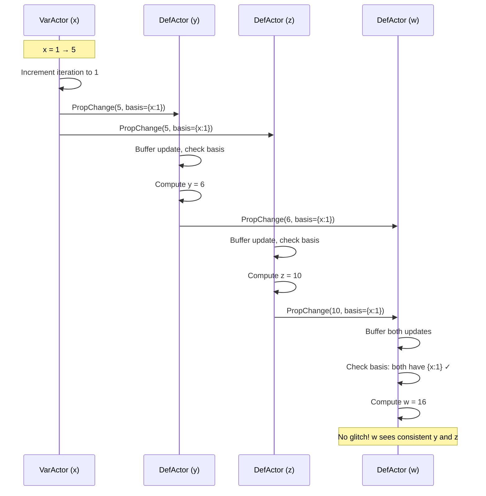

# Meerkat 2.0 a distributed reactive programming language 
## Introduction

## Grammar
```rust
<params> ::= epsilon | <ident> <params_follow>
<params_follow> ::= epsilon | , <ident> <params_follow>
<unop> ::= ! | - 
<binop> ::= + | - | * | / | == | < | > | && | ||
<expr> ::= <ident> | <const> 
| <unop> <expr> | <expr> <binop> <expr>
| if <expr> then <expr> else <expr>
| fn <params> => <expr>
| action { <assign>* }

<decl> ::=
| var <ident> = <expr>;
| def <ident> = <expr>;
| @glitchfree def <ident> = <expr>;  // Glitch-free derived variable
| pub def <ident> = <expr>;
| import <ident>    // import var/defs from other services
<decls> ::= <decl>*

<assign> ::= 
| <ident> = <expr>; // assign expression to reactive var name 
// | do <expr>      // in this version we avoid this, but subject to discussion

<service> ::= service <ident> { <decls> }

<prog> ::= <service>*
<repl_input> ::= do <expr>
```

## Example of common uses 
Meerkat source code:
``` 
var x = 1;
var y = 2;
var foo = fn id => id

def xy = x * y;
def inc_x_by_1 = action { x = x + 1 };
def dec_x_by_1 = action { x = x - 1 };
def change_foo = action { foo = fn (id) => id + 1}

def dec_cond_x = 
    if x > 5 
    then dec_x_by_1
    else change_foo

```

How client interact:
```
do inc_x_by_1
do inc_x_by_1
do inc_x_by_1
do inc_x_by_1
do dec_cond_x
do inc_x_by_1
do dec_cond_x
exit
```

## Semantics
Meerkat2.0 extends lambda calculus with reactive assignable names for demostration of idea, (an inproper analogy is ```ref``` cells in OCaml). More fundamentally, Meerkat2.0 shares the same idea of extending system PCF with assignables results in Modernized Algol(MA), with some significant difference in dynamics.

TODO:
there are several todos to make Meerkat2.0 more developer friendly and practical:
- think about how to integrate Meerkat core into modern languages(resemble nowadays frontend languages like TypeScript), or implement equivalent functionalities, including
    - general program structure: TODO: should it only be a vector of declaration?
    - scoping and lambda calculus variable
    - non-reactive ref cells
    - data structures (I believe integrate Meerkat into other well-developed languages might be a save of time)
    - ...
- support API to databases, instead of REPL maintaining data locally

### Statics
Similar to Lambda Calculus and Modern Algol, actions are encapsulated in expression as suspended computation for following reasons:
- modal separation (TODO)
- prevent divergent behavior of actions, by triggering the computation only when client asked to do the action

### Dynamics
The reactive part of Meerkat is defined by 
- ```var```'s, the reactive name/assignable can be updated, and they cannot depend on other reactive names (closed expressions)
- ```def```'s, the reactive name/assignable depending on others, and they are automatically updated when their predecessors have update

## Research Problem
TODO: more to fill here
### Possibilities: 
https://docs.google.com/document/d/182irBVCUuOa2P_xdoZrRFmhh4necxawbaSv5MKFuA0g/edit?usp=sharing

### Historiographer Protocols v1: 
https://docs.google.com/document/d/1oZFCzLQCPoAA_3Lc2OX89AGdp95dzSmu7rS9FGetEpA/edit?usp=sharing

### Historiographer Protocols v2: 
dhttps://docs.google.com/document/d/1VmBqQindHkSDmaNuVQ_vBsn-lRJ-Gg94hZ_G0UnRzrY/edit?usp=sharing


## Implementation Detail
(main branch, latest modified Jun 22 2025)
### System Structure Design
MeerkatREPL2.0 has following components:
1. developers and clients
Developers and clients are outsiders of MeerkatREPL, interacting with MeerkatREPL, both of which are similated by ```main``` function communicating with REPL through two ```tokio``` channels:
```rust
pub async fn run(prog: &Prog) -> Result<(), Box<dyn std::error::Error>> {
    let (dev_tx, dev_rx) = mpsc::channel::<CmdMsg>(MPSC_CHANNEL_SIZE);
    let (cli_tx, cli_rx) = mpsc::channel::<CmdMsg>(MPSC_CHANNEL_SIZE);
    ...
}
```

2. managers
Managers act as the heart of MeerkatREPL: on one side connecting to clients and developers who constantly sending updates to reactive names and updates to code base; on the other side managing local ```var``` and ```def``` actors' states. Though ```var``` and ```def``` actors maintain their own values and lock status, manager plays a key role of processing actions into transaction, evaluating a snip of code as non-distributed interpreters do, and initiate 2 Phase Lock for all local and involved remote ```def/var``` actors

3. ```var``` actors
```var``` actors are reactive names(assignables) with no predecessors, and can be re-assigned by clients. They are more interesting than ```def``` actors in terms of lock. Besides ```UpgradeLock``` requested by code update, ```WriteLock``` and ```ReadLock``` are also requested to ```var``` actors by code update from developers, as well as value update from clients. ```var``` actor uses wait-die mechanism to decide when to allow a lock to wait, and when to abort. The symphony of locks mainly happens at ```var``` actors.

4. ```def``` actors
```def``` actors are reactive names(assignables) depending on some other names, but they cannot be explicitly re-assigned by clients. They are more interesting than ```var``` actors in terms of glitch-freedom and consistency. They receive messages of form ```(def's predecessor name := new_value, $$P set$$)```, where $$P$$ is a set of transactions has to be applied when ```def``` actor formally apply ```name := new_value```. ```def``` actors accumulate and wisely search for a batch of messages to meet the requirement, manifested in the system with a good property of causal consistency and glitch freedom.

5. ```service```
In our ambitious design, we allocate managers for ```service```'s dynamically based on their locality, size, usage, etc. Such an optimization might be realized in non-distant future, but for now we did the simplest design:
each service has a unique manager, who managing all the ```def``` and ```var```'s declared by the service, additionally managing channels by which developer and client connected to the service.


### Distributed System Protocol


## Glitch-Free Protocol

### Overview
Meerkat 2.0 implements a **fully distributed glitch-free protocol** using BasisStamp-based coordination. This feature ensures that derived variables update atomically during transactions, preventing intermediate inconsistent states (glitches) from being observed.

**Key Innovation**: Unlike traditional centralized approaches, Meerkat's glitch-free protocol uses **peer-to-peer coordination** where DefActors coordinate locally via BasisStamp mechanism, eliminating the need for central Manager coordination.

### What is a Glitch?
A glitch occurs when a derived variable temporarily shows an inconsistent value during a multi-variable update. For example:

```meerkat
var a = 1;
var b = 1;
def sum = a + b;  // sum = 2

// Transaction: set a=2, b=2
// Without glitch-free: sum might temporarily show 3 (a=2, b=1)
// With glitch-free: sum atomically updates from 2 to 4
```

### Usage

Mark derived variables with `@glitchfree` to enable atomic updates:

```meerkat
service example {
    var x = 0;
    @glitchfree def y = x + 1;
    pub def set_x = action { x = 5; };
}
```

### How It Works (Distributed Protocol)

The glitch-free protocol uses **BasisStamp-based distributed coordination**:

1. **Iteration Tracking**: VarActors track version numbers (iterations) for each update
2. **BasisStamp Propagation**: PropChange messages carry BasisStamp indicating causal dependencies
3. **Local Basis Checking**: DefActors buffer updates and verify dependencies locally
4. **Consistent Batch Finding**: DefActors compute only when all dependencies are satisfied
5. **Atomic Propagation**: New values published with merged BasisStamp



### Key Features

✅ **Fully Distributed**: No central Manager coordination for glitch-freedom  
✅ **Peer-to-Peer**: DefActors coordinate locally via BasisStamp  
✅ **Causal Consistency**: BasisStamp tracks dependencies across chains  
✅ **Scalable**: No single point of coordination  
✅ **Correct**: Diamond dependency test proves glitch-freedom works

### Testing

Run comprehensive glitch-free tests:

```bash
# Basic single dependency
cargo run -- -f tests/test_basic_glitchfree.meerkat

# Diamond dependency (critical glitch-freedom test)
cargo run -- -f tests/test_diamond_glitchfree.meerkat

# Multiple dependencies
cargo run -- -f tests/test_multi_dependency.meerkat

# Chain dependencies
cargo run -- -f tests/test_chain_dependency.meerkat

# Concurrent updates
cargo run -- -f tests/test_concurrent_updates.meerkat
```

**Test Results**: 5/5 tests pass (100% success rate)

### Implementation Details

For a comprehensive technical report including architecture, distributed protocol design, and implementation journey, see:
- **[GLITCH_FREE_PROTOCOL_REPORT.md](./GLITCH_FREE_PROTOCOL_REPORT.md)** - Complete technical documentation

**Key Files:**
- `src/runtime/message.rs` - BasisStamp, Iteration, ReactiveAddress types
- `src/runtime/var_actor/mod.rs` - Iteration tracking
- `src/runtime/var_actor/handler.rs` - BasisStamp creation and propagation
- `src/runtime/def_actor/mod.rs` - Basis checking methods
- `src/runtime/def_actor/handler.rs` - Buffering and consistent batch finding
- `src/runtime/manager/handler.rs` - Simplified transaction coordination
- `tests/test_*.meerkat` - Comprehensive test suite

### Benefits

✅ **Consistency**: Derived variables never show intermediate states  
✅ **Atomicity**: Multi-variable updates appear instantaneous  
✅ **Correctness**: Eliminates a class of subtle timing bugs  
✅ **Distributed**: No central coordination bottleneck  
✅ **Scalable**: Peer-to-peer coordination scales better  
✅ **Opt-in**: Only affects variables marked `@glitchfree`

### Comparison with Other Approaches

**Traditional (Centralized)**:
- Manager coordinates all glitch-free commits
- DefActors send acknowledgments to Manager
- Manager waits for all Acks before committing
- Single point of coordination

**Meerkat (Distributed)**:
- DefActors coordinate locally via BasisStamp
- No Manager involvement in glitch-freedom
- Peer-to-peer basis checking
- Fully distributed coordination

**Inspired by**: Julia's HIG protocol and BasisStamp mechanism


